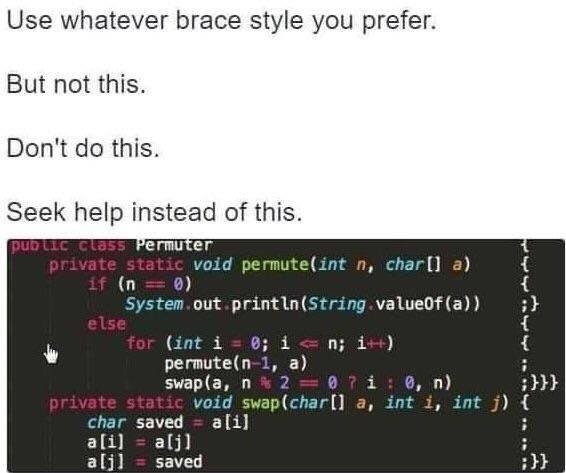

# LostTemple
로템 2v2 초보만

## What it is?

LostTemple 은 C언어를 파이썬 처럼 쓰게 도와주는 트랜스파일러 입니다.



위의 사진처럼 다른언어에서도 파이썬처럼 { } 와 ; 없이 코드를 짜고 싶어집니다.

LostTemple 을 사용하여 트랜스파일하면

```c
import <stdio.h>

int main():
    printf("hello world")

    return false

```

위의 코드를 아래의

      ↓ ↓ ↓ ↓ ↓ ↓

```
#include <stdio.h>

int main() {
    printf("hello world");

    return 0;
}
```

와 같은 형식으로 변환 시킬 수 있습니다.
